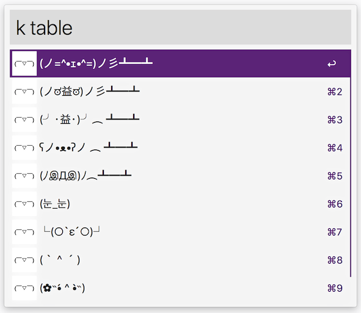

# alfred-kaomoji

Alfred workflow for looking up emoji and kaomoji. Both are loaded from getdango.com service.

## Download

Download version 1.0.1 [kaomoji](https://github.com/dvor/alfred-kaomoji/releases/download/1.0.1/kaomoji.alfredworkflow).

## Usage

Type `e` followed by a query to search for emojis.

Type `k` followed by a query to search for kaomojis.

